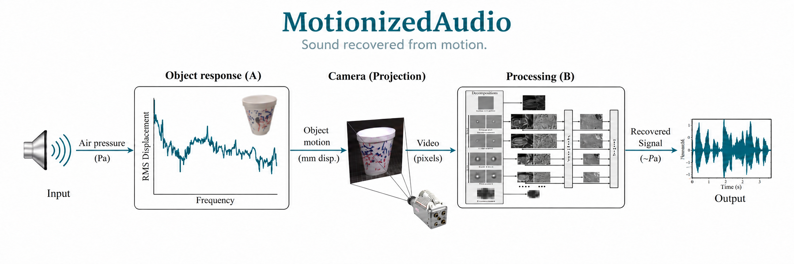

# MotionizedAudio

**Development history:** Developed locally before publication. These repositories were uploaded together, so their GitHub publication dates do not indicate when development began.

**Hear the motion. Recover sound from video.**

MotionizedAudio extracts tiny surface vibrations from high-speed footage and
reconstructs them as a WAV audio signal. Focus on an object, choose a frequency
range, and process on CPU or an NVIDIA CUDA GPU.



## Quick start

Python 3.11 or 3.12 is recommended. Use the supplied dependencies: the wavelet
engine requires NumPy 1.x.

```bash
git clone https://github.com/nazeeh111/MotionizedAudio.git
cd MotionizedAudio
python3.12 -m venv .venv
source .venv/bin/activate
pip install -r requirements.txt
python motionized_audio.py -i recording.avi -o recovered.wav
```

Use `--fps` for the camera's actual capture rate when it differs from the
playback rate stored in the video. High-speed capture is important: a 30 fps
recording cannot recover the same frequency range as a 2200 fps recording.
The illustrative diagram above is explanatory artwork, not measurement evidence.

## Usage

### CLI Tool

```bash
# Basic usage
python motionized_audio.py -i testvid.avi -o recovered_audio.wav

# With temporal bandpass filter
python motionized_audio.py -i testvid.avi -fl 80 -fh 1000

# With ROI (focus on vibrating object)
python motionized_audio.py -i testvid.avi --roi 100,50,200,150

# Override frame rate for high-speed video
python motionized_audio.py -i Chips1-2200Hz-Mary_Had-input.avi --fps 2200

# GPU acceleration
python motionized_audio.py -i testvid.avi --gpu --batch-size 32

# Custom wavelet filters
python motionized_audio.py -i testvid.avi --biort near_sym_a --qshift qshift_a
```

| Flag | Default | Description |
|---|---|---|
| `-i / --input` | *(required)* | Input video path |
| `-o / --output` | `sound.wav` | Output audio path |
| `-fl / --freq-low` | — | Lower cutoff frequency (Hz) for temporal bandpass filter |
| `-fh / --freq-high` | — | Upper cutoff frequency (Hz) for temporal bandpass filter |
| `--fps` | — | Override video frame rate (Hz) for audio sample rate |
| `--roi` | — | Region of interest as `x,y,w,h` |
| `--gpu` | off | Use GPU-accelerated DTCWT (requires CUDA + pytorch_wavelets) |
| `--batch-size` | 16 | Frames per GPU batch (GPU mode only) |
| `--nlevels` | 3 | Number of DTCWT decomposition levels |
| `--biort` | `near_sym_b` | Biorthogonal wavelet filter for DTCWT level 1 |
| `--qshift` | `qshift_b` | Quarter-shift wavelet filter for DTCWT levels 2+ |
| `--version` | — | Show program version and exit |

**Available wavelet filters:**
- `--biort`: `antonini`, `legall`, `near_sym_a`, `near_sym_b`
- `--qshift`: `qshift_06`, `qshift_a`, `qshift_b`, `qshift_c`, `qshift_d`

When `-fl` and/or `-fh` are specified, a Butterworth filter is applied to the phase signals before audio reconstruction, rejecting low-frequency drift and high-frequency noise.

When `--fps` is specified, the given value is used as the audio sample rate instead of the frame rate reported by the video container. This is necessary for high-speed camera footage where the container frame rate does not reflect the actual capture rate.

When `--roi` is specified, each frame is cropped to the given rectangle before the DTCWT decomposition. This reduces computation and can improve SNR by focusing on the vibrating object.

## Containers

```bash
# CPU
./docker-build.sh
docker run --rm -v /absolute/path/to/videos:/data motionized-audio:latest \
  -i /data/recording.avi -o /data/recovered.wav

# NVIDIA GPU: requires Docker GPU support and a CUDA-capable NVIDIA GPU
./docker-build-gpu.sh
docker run --rm --gpus all -v /absolute/path/to/videos:/data motionized-audio-gpu:latest \
  --gpu -i /data/recording.avi -o /data/recovered.wav --fps 2200
```

CPU and GPU processing use different numerical precision and are not expected
to be byte-identical to each other. Lower `--batch-size` if GPU memory is limited.

## Verification and development

```bash
pip install -r requirements-dev.txt
python -m pytest tests/ -q
ruff check .
```

Local checks passed 28 CPU tests and five byte-identical output comparisons.
Seven CUDA tests were skipped because NVIDIA hardware was unavailable.
See [verification details](VERIFICATION.md) for the tested versions and limits.
The compatible `visualmic.py` command and import remain available.

## Project

Maintained by [nazeeh111](https://github.com/nazeeh111).

## License

Available under the [MIT license](LICENSE).
